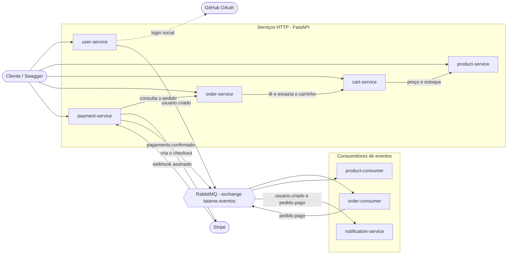

# Tatame

E-commerce de artigos de jiu-jitsu em microsserviços, feito em Python/FastAPI.

## Arquitetura

```mermaid
flowchart LR
    Cliente([Cliente / Swagger])

    subgraph HTTP[Serviços HTTP - FastAPI]
        USER[user-service]
        PRODUCT[product-service]
        CART[cart-service]
        ORDER[order-service]
        PAYMENT[payment-service]
    end

    subgraph EVENTOS[Consumidores de eventos]
        ORDERC[order-consumer]
        PRODUCTC[product-consumer]
        NOTIF[notification-service]
    end

    MQ{{RabbitMQ - exchange tatame.eventos}}
    STRIPE([Stripe])
    GITHUB([GitHub OAuth])

    Cliente --> USER & PRODUCT & CART & ORDER & PAYMENT
    USER -.->|login social| GITHUB
    CART -->|preço e estoque| PRODUCT
    ORDER -->|lê e esvazia o carrinho| CART
    PAYMENT -->|consulta o pedido| ORDER
    PAYMENT -->|cria o checkout| STRIPE
    STRIPE -->|webhook assinado| PAYMENT

    USER -->|usuario.criado| MQ
    PAYMENT -->|pagamento.confirmado| MQ
    MQ --> ORDERC
    ORDERC -->|pedido.pago| MQ
    MQ --> PRODUCTC
    MQ -->|usuario.criado e pedido.pago| NOTIF
```